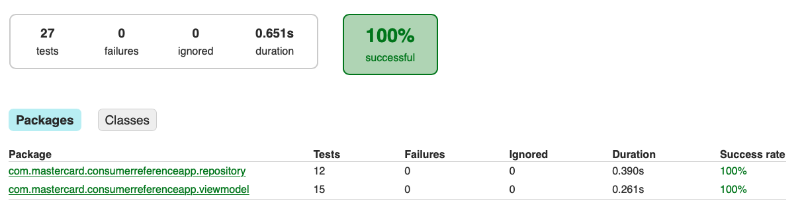
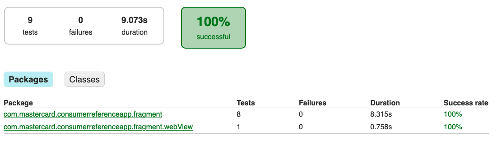
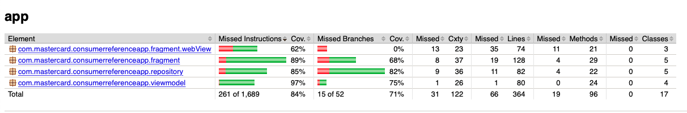

# Consumer Reference Application
This reference android application is part of the reference guide for developer to fully use Mastercard Pay on Demand for Digital Inclusion solution.

## Android Build Environment
* Java 8
* Gradle 5.6.4
* Android SDK Version 29
* Android Studio 3.6.3

## Required Components:
- Financier server & web portal (https://gitlab.com/mastercard/pods/financier_server_reference_app#financier-server-web-portal).
- Consumer reference app backend server (https://gitlab.com/mastercard/pods/financier_server_reference_app#consumer-reference-app-backend).
- Android phone or emulator running on Android 9 (API 28) or Android 10 (API 29).

## Prerequisite
- Please refer to this [Financier Server & Web Portal Guide](https://gitlab.com/mastercard/pods/financier_server_reference_app#financier-server-web-portal) to build and run the Financier Server & Web Portal.
- `(important)` Use the Financier Web Portal, get a financier then create a contract before continuing with the steps below.

## Setup
- The reference backend server is required for this app to communicate. You may refer to the `Consumer Reference App Backend section` in this [Consumer Reference App Backend Server Guide](https://gitlab.com/mastercard/pods/financier_server_reference_app#consumer-reference-app-backend) for the setup of the sever.
- Using Android Studio or any IDE of your choice to build the app from the source code.

**NOTE: The compile SDK version 29 is required for the app to build. Make sure you have SDK level 29 installed in your SDK Manager (tools -> SDK Manager -> check the box for Android 10 (Q) API Level 29).**

## How To Use It
1. Upon having the consumer reference app backend server started, you can get the server ip and port from the consumer reference app backend server startup log.
2. Using Android Studio or any IDE of your choice to build and launch the consumer reference android app in the phone or emulator.
3. In the android application, click setting icon on the top right corner. Using the server ip and port you obtained in **step 1**, verify that your server url has been pre-filled with the following format **http://your-server-ip-address:8081/**. If it's correct, you can skip **step 4** and go directly to **step 5**.
4. `(If it doesn't)` using the server ip address and port you obtained in **step 1** and key in the server url in this following format **http://your-server-ip-address:8081/** then click submit.
5. You may now start using the app.
6. When make a payment or adding a new card, you may use the following test card PAN to test:
      - `5123450000000008` with 3DS verification.
      - `5111111111111118` without 3DS verification.

## Developer Guide
In customer reference app, there are 3 main core features demonstrated:

#### Get User Contract Information
- The contract information should be retrieve from the consumer reference app backend server and display accordingly in the app home screen.
- You may use `/contract` api to retrieve the information from the Consumer reference app backend server.

#### Android Webview For Payment & Manage Card
- In order to process the payment, please implement the webview to handle the payment flow.
- Please also prevent the redirection to the phone default browser (this means the entire payment process `must only be within the webview`.
- When user click make payment, the application should call the consumer reference app backend server to retrieve the `payment data` which contains `url and authorization bearer token`.
- Upon getting the `payment data`, before loading the url in the webview, first format the token string to be `Bearer <token>`, then add that to the `Authorization header`.

#### Handle The Callback From Mastercard Payment Web
- When user finish the payment in the webview, a popup modal showing the status of the payment will appear in the webview environment. The user action for the popup modal is the ok button.
- Upon user clicking the ok button, our payment web will detect if it's Android webview environment then return a callback to the Android Javascript interface with 2 parameter `sessionId (string) and isSuccessful (string of true or false)`.
- In order to use that callback, you are required to implement the Javascript Interface in Android:
  - First, our WebAppInterface into your app code:
  ```
  public interface WebAppInterface {
    // TODO: when implement this method, please remember to add @JavascriptInterface annotation!
    void dismissWebView(String sessionId, String isSuccessful);
    }
  ```
  - Create a class to implement the WebAppInterface.
  - In the implementation class, add @JavascriptInterface annotation to the dismissWebView method.
  - In the Webview Fragment, when setting up the webview, add the following line `(make sure javascript interface name is Android)`:
  ```
  String javascriptInterfaceName = "Android"; // Make sure the interface name is Android
  binding.webView.addJavascriptInterface(new WebAppInterfaceImpl(this), javascriptInterfaceName);
  ```
#### Unit Test Coverage Report
* Ensure that you have at least one AVD setup for the UI tests.
* Execute the test command below and view the report at **`./app/build/report/jacocoTestReport/html/index.html`**
    ```
    ./gradlew clean jacocoTestReport
    ```

## Report
#### Latest Unit Test Run:


#### Latest Instrumented UI Test Run:


#### Latest Code Coverage Report:

